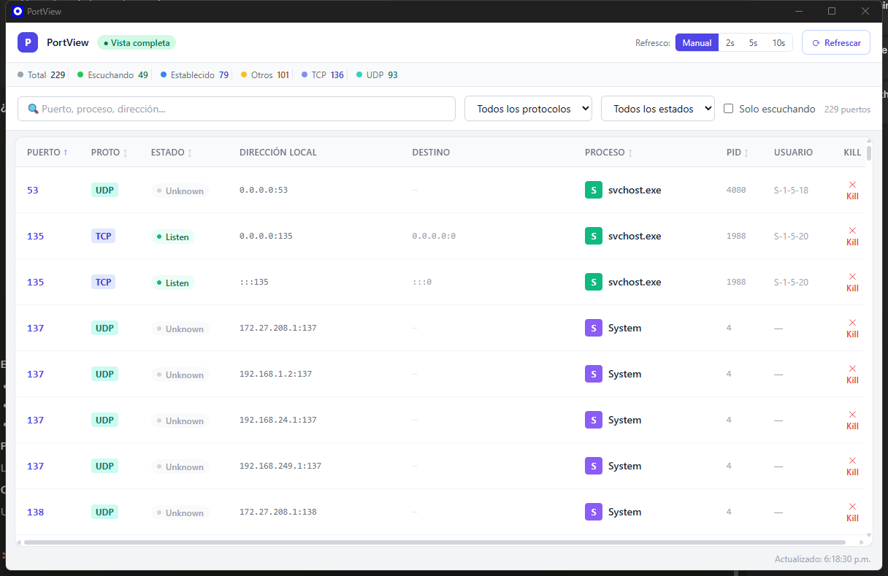

# PortView

> Visor gráfico multiplataforma de puertos de red — Windows · macOS · Linux

PortView es una aplicación de escritorio que te permite **ver, filtrar y terminar** cualquier proceso que ocupe un puerto en tu máquina, con una interfaz clara y actualización en tiempo real.



---

## Instalación

### 🪟 Windows

| Archivo | Descripción |
|---------|-------------|
| `PortView_*_x64_es-ES.msi` | **Recomendado.** Instalador MSI, integra con Agregar/Quitar programas |
| `PortView_*_x64-setup.exe` | Instalador NSIS standalone |

Descarga uno de los dos desde [**Releases**](https://github.com/Jonddos/portview/releases/latest), ejecútalo y sigue el asistente.

---

### 🍎 macOS

| Archivo | Para quién |
|---------|------------|
| `PortView_*_aarch64.dmg` | **Mac con chip M1 / M2 / M3 / M4** (Apple Silicon) |
| `PortView_*_x64.dmg` | Mac con procesador **Intel** |

> 💡 ¿No sabes cuál tienes? Menú Apple → Acerca de este Mac → busca "Apple M..." (Silicon) o "Intel Core" (Intel)

**Cómo instalar:**
1. Descarga el `.dmg` desde [**Releases**](https://github.com/Jonddos/portview/releases/latest)
2. Ábrelo y arrastra **PortView** a la carpeta **Aplicaciones**
3. La primera vez macOS bloqueará la app (no tiene firma de Apple). Abre **Terminal** y ejecuta:
```bash
xattr -dr com.apple.quarantine /Applications/PortView.app
codesign --force --deep --sign - /Applications/PortView.app
```
4. Abre PortView desde Launchpad normalmente

---

### 🐧 Linux

| Archivo | Para quién |
|---------|------------|
| `PortView_*_amd64.AppImage` | **Cualquier distro** — no requiere instalación |
| `PortView_*_amd64.deb` | Ubuntu / Debian / Mint |
| `PortView-*_x86_64.rpm` | Fedora / RHEL / openSUSE |

```bash
# AppImage (universal)
chmod +x PortView_*.AppImage && ./PortView_*.AppImage

# .deb (Ubuntu/Debian)
sudo dpkg -i PortView_*.deb

# .rpm (Fedora/RHEL)
sudo rpm -i PortView-*.rpm
```

➡️ **[Ver todos los instaladores en Releases](https://github.com/Jonddos/portview/releases/latest)**

---

## Características

- **Escaneo completo** de puertos TCP/UDP activos con PID, proceso, ruta del ejecutable y usuario
- **Soporte WSL2** — los puertos corriendo en subsistemas Linux aparecen con badge violeta **WSL**
- **Kill de proceso** — botón por fila con diálogo de confirmación; en WSL mata el grupo completo (master + workers)
- **Panel de detalle** — CPU %, memoria, uptime y ruta del ejecutable al hacer click en una fila
- **Filtros y búsqueda** — por protocolo, estado, texto libre; opción "Solo escuchando"
- **Auto-refresco** — Manual / 2s / 5s / 10s
- **Elevación de privilegios** — banner UAC (Windows) / osascript (macOS) / pkexec (Linux)

---

## Stack

- **Backend/Core**: [Rust](https://www.rust-lang.org/) — `netstat2` + `sysinfo`; Linux nativo via `ss`
- **Framework**: [Tauri v2](https://tauri.app/) — binarios ~3 MB, webview nativa
- **Frontend**: React + TypeScript + Vite + Tailwind CSS

---

## Desarrollo local

```bash
# 1. Clonar
git clone https://github.com/Jonddos/portview.git
cd portview

# 2. Instalar dependencias del frontend
cd ui && pnpm install && cd ..

# 3. Lanzar en modo desarrollo (hot-reload)
cargo tauri dev

# 4. Construir para producción
cargo tauri build
```

**Requisitos**: Rust 1.77+, Node.js 20+, pnpm 9+

**Linux**: requiere `libwebkit2gtk-4.1-dev libssl-dev libgtk-3-dev libayatana-appindicator3-dev librsvg2-dev`

---

## Estructura del proyecto

```
portview/
├── src-tauri/          # Backend Rust + configuración Tauri
│   └── src/core/       # scanner.rs, wsl.rs, process.rs
├── ui/                 # Frontend React + Vite
│   └── src/            # components/, hooks/, types/
├── docs/               # ARCHITECTURE, DEVELOPMENT, PERMISSIONS, RELEASING
└── .github/workflows/  # CI multiplataforma (release.yml)
```

---

## Contribuir

Ver [CONTRIBUTING.md](CONTRIBUTING.md) · [CHANGELOG.md](CHANGELOG.md) · [Licencia MIT](LICENSE)
